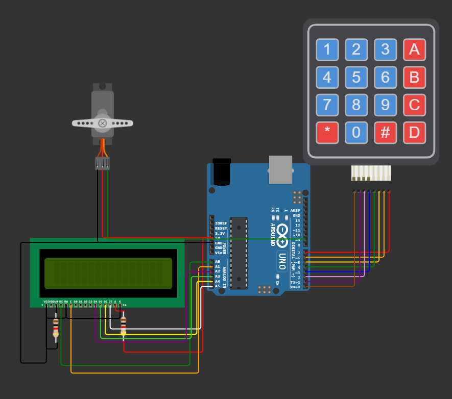

# Digital Keypad Security Door Lock using Arduino

## บทคัดย่อ
 ชื่อโครงงานภาษาไทย :  ระบบล็อคประตูโดยใช้ Arduino
 ชื่อโครงงานภาษาอังกฤษ : Digital Keypad Security Door Lock using Arduino
 ชื่อผู้ทำโครงงาน : นาย กิตตินันท์ เจริญทรง 64070007
 &emsp;&emsp;&emsp;&emsp;&emsp;&emsp;&emsp;&emsp;นาย พัสกร คำแก้ว 64070073
 &emsp;&emsp;&emsp;&emsp;&emsp;&emsp;&emsp;&emsp;นาย พุฒิพงษ์ ชอบงาม 64070079
 &emsp;&emsp;&emsp;&emsp;&emsp;&emsp;&emsp;&emsp;นาย ธนวรรษ นันทะกูล 64070158
 ปีที่ทำโครงงาน : 2565

 &emsp;&emsp;&emsp;&emsp;โครงงานเรื่อง ระบบล็อคประตูโดยใช้ Arduino จัดทำขึ้นโดยมีวัตถุประสงค์เพื่อใช้ในการศึกษาเกี่ยวกับการทำงานของ Arduino และยังสามารถนำไปต่อยอดโดยการเอาไปใช้จริงในชีวิตประจำวันได้
 &emsp;&emsp;&emsp;&emsp;สรุปผลการทำโครงงาน ได้ทำการต่อบอร์ด Arduino เข้ากับวงจรจากนั้นได้ทำการเขียนโค้ดให้บอร์ด Arduino ซึ่งวงจรกับบอร์ด Arduino สามารถทำงานได้ปกติ โดยรวมแล้วระบบล็อคประตูโดยใช้ Arduino สามารถทำงานได้ปกติ
 &emsp;&emsp;&emsp;&emsp;คำสำคัญ ระบบล็อค, บอร์ด Arduino
## เกี่ยวกับโปรเจค
 &emsp;&emsp;&emsp;&emsp;ระบบล็อคประตูโดยใช้ Arduino board จัดทำขึ้นโดยมีวัตถุประสงค์เพื่อใช้ในการศึกษาเกี่ยวกับการทำงานของ Arduino และยังสามารถนำไปใช้เพื่อยกระดับความปลอดภัยได้
## Arduino Board

## Keypad

## Monitor & Servo
